# REST API Call Sequence Diagram

This document describes **which** component calls **which** API endpoint and **when**, for the thingsApp Android app.

---

## Simple sequence diagram (UI, Background, Server)

Only three participants and API call names:

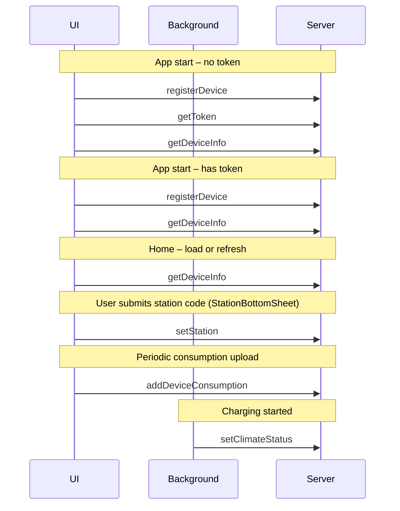

| From   | API call            | When |
|--------|---------------------|------|
| UI     | registerDevice      | App start (init / sync) |
| UI     | getToken            | App start, no token |
| UI     | getDeviceInfo       | App start, Home load/refresh |
| UI     | setStation          | User submits from StationBottomSheet |
| UI     | addDeviceConsumption| Periodic upload |
| Background | setClimateStatus | Charging started (when token exists) |

---

## Master sequence diagram (all REST API flows)

One diagram showing **who calls what and when**:

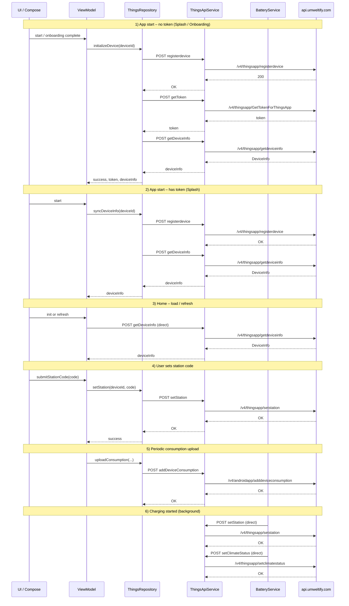

**To view the diagram:** Open this file in VS Code/Cursor or on GitHub; the Mermaid block above will render as a sequence diagram.

---

## Sample 1: Background Service – API calls

Only the **background service** (BatteryService) and which APIs it calls. **setStation is never called from background** — only from the UI when the user submits from StationBottomSheet.

**When:** Device starts charging → `BatteryService.handleChargingStarted()` runs.

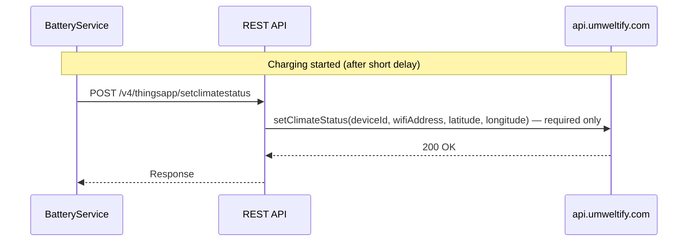

| Call | Endpoint | When | Payload |
|------|----------|------|---------|
| 1 | `POST /v4/thingsapp/setclimatestatus` | At plug-in (charging started) | **Required:** wifi id (wiFiAddress), device id, location (lat/lon). Optional: device name, os version, etc. are not sent. |

---

## Sample 2: UI – API calls

Only the **UI path**: user or screen triggers that lead to API calls. No repository or service layers in the diagram.

**When:** App start, refresh, user actions (station code, etc.).

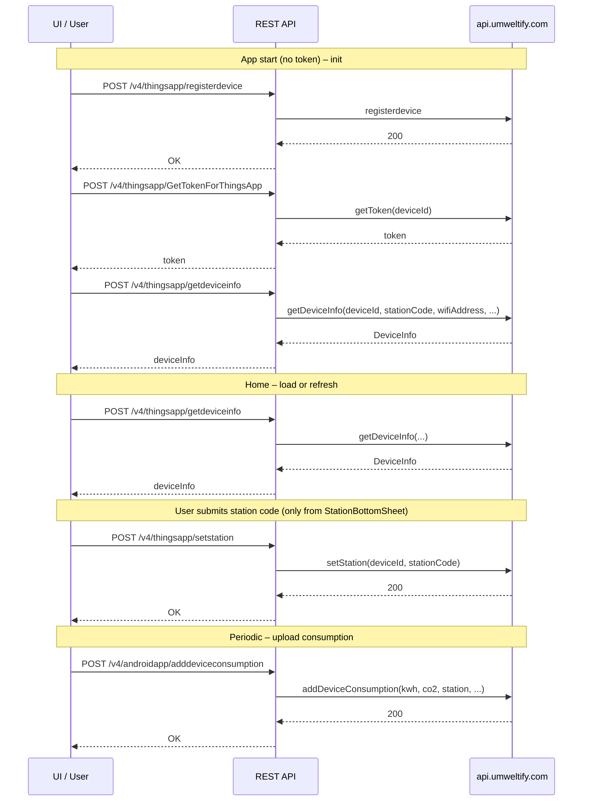

| Call | Endpoint | When |
|------|----------|------|
| 1 | `POST /v4/thingsapp/registerdevice` | App start (first time / no token) |
| 2 | `POST /v4/thingsapp/GetTokenForThingsApp` | After register, get token |
| 3 | `POST /v4/thingsapp/getdeviceinfo` | After token; also Home load/refresh |
| 4 | `POST /v4/thingsapp/setstation` | **Only** when user submits from Home → StationBottomSheet (not from background or other screens) |
| 5 | `POST /v4/androidapp/adddeviceconsumption` | Periodic consumption upload (e.g. when charging) |

---

## 1. High-level flow (who calls the API)

```
┌─────────────┐     ┌──────────────────┐     ┌─────────────────┐     ┌──────────────┐     ┌────────┐
│ UI / View   │────▶│ ViewModel        │────▶│ ThingsRepository│────▶│ ThingsApi    │────▶│ Server │
│ (Compose)   │     │ (Home, Splash,   │     │ (or direct      │     │ (Retrofit)   │     │ API    │
│             │     │  Auth, etc.)     │     │  NetworkModule) │     │ + OkHttp     │     │        │
└─────────────┘     └──────────────────┘     └─────────────────┘     └──────────────┘     └────────┘
                           │                          │
                           │                          │ BatteryService
                           │                          │ (background) ──────────────────▶ same API
```

- **ThingsRepository** holds business logic and calls `NetworkModule.api` (Retrofit `ThingsApiService`).
- **HomeViewModel** sometimes calls `NetworkModule.api.getDeviceInfo()` **directly** (no repository).
- **BatteryService** calls `NetworkModule.api.setClimateStatus()` and `NetworkModule.api.setStation()` **directly** when charging starts.

---

## 2. Mermaid sequence diagram – all API flows

Below, **participants** are: ViewModels/UI, ThingsRepository, ThingsApiService (Retrofit), OkHttp (interceptors add token + logging), and Server.

### 2.1 Device initialization (first launch / onboarding / no token)

**When:** Splash (no cached token) or Onboarding after user continues.

**Callers:** `SplashViewModel.checkAppStart()` or `OnboardingViewModel` → `ThingsRepository.initializeDevice()`.

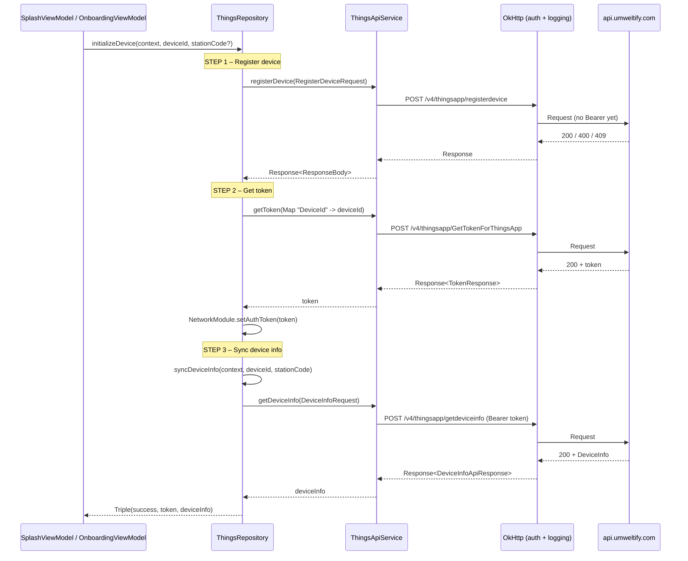

---

### 2.2 Splash with cached token (device already registered)

**When:** App start and `TokenManager` already has a token.

**Caller:** `SplashViewModel.checkAppStart()` → `ThingsRepository.syncDeviceInfo()`.

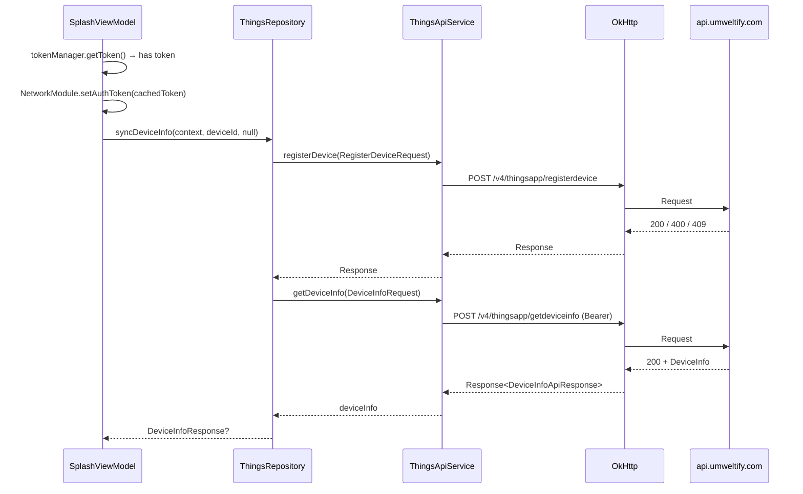

---

### 2.3 Home – load device info (refresh / init)

**When:** Home screen init or user-triggered refresh.

**Caller:** `HomeViewModel.loadDeviceInfo()` → **direct** `NetworkModule.api.getDeviceInfo()` (no repository).

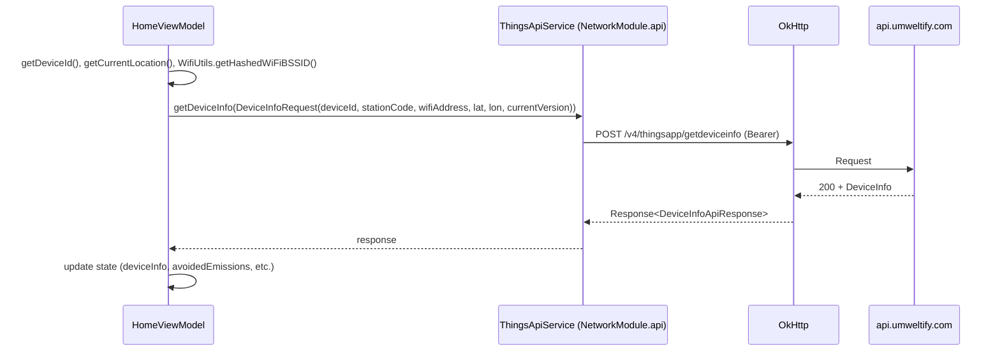

---

### 2.4 Set station code (user submits station)

**When:** User submits station code on Home or in Authorize flow.

**Callers:** `HomeViewModel.submitStationCode()` or `AuthorizeViewModel` → `ThingsRepository.setStation()`.

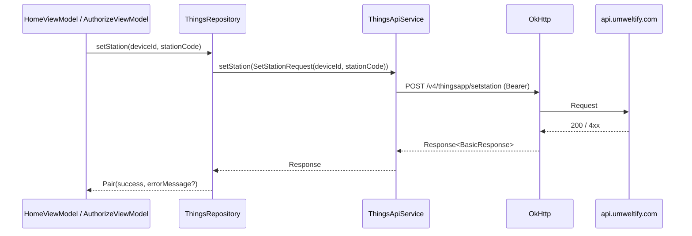

---

### 2.5 Upload consumption (periodic from Home)

**When:** HomeViewModel periodic job (e.g. every minute when charging) to report battery consumption.

**Caller:** `HomeViewModel` (scheduled) → `ThingsRepository.uploadConsumption()`.

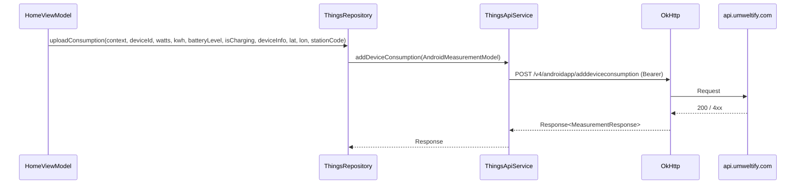

---

### 2.6 Charging started (BatteryService – background)

**When:** Device starts charging; `BatteryService.handleChargingStarted()` runs after a short delay.

**Caller:** `BatteryService` → **direct** `NetworkModule.api` (no repository).

Two requests are sent:

1. **setStation** – station/consumption/voltage/watt at charging start.
2. **setClimateStatus** – sync climate status with station.

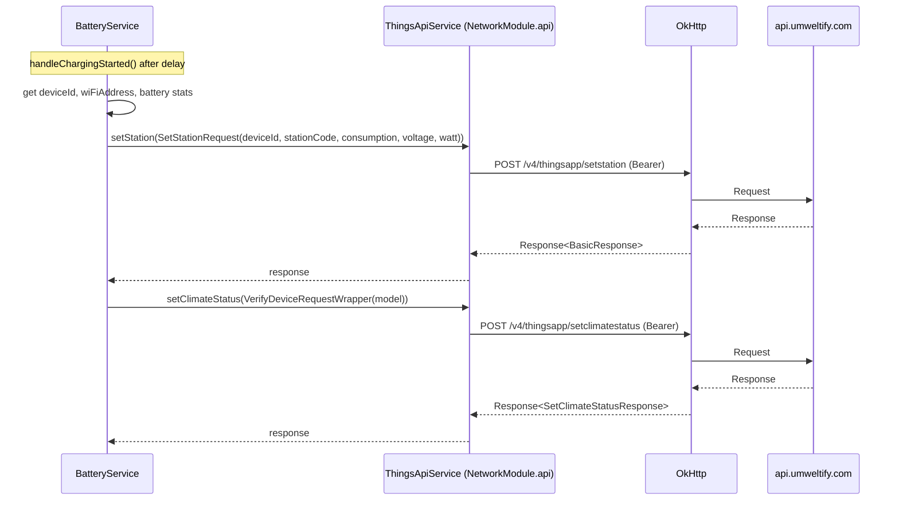

---

### 2.7 Update device alias

**When:** User changes device name/alias.

**Caller:** Any ViewModel that has this feature → `ThingsRepository.updateAlias()`.

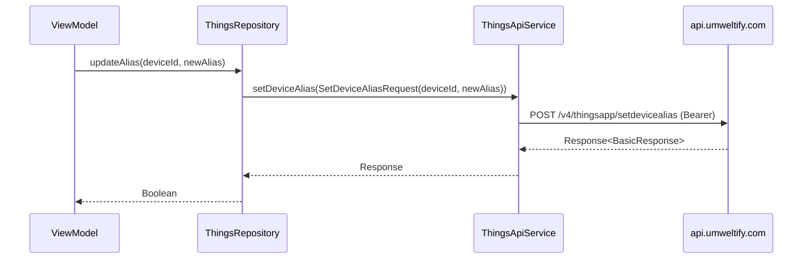

---

### 2.8 Green login authorization

**When:** User authorizes a “Green Login” request (e.g. from another device or web).

**Caller:** `AuthorizeViewModel` → `ThingsRepository.authorizeGreenLogin()`.

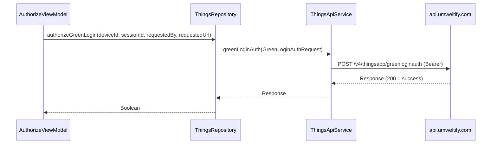

---

### 2.9 Authenticate (token only)

**When:** Need a new token without full device init (e.g. re-auth).

**Caller:** `ThingsRepository.authenticate(deviceId)` (used internally or by flows that only need token).

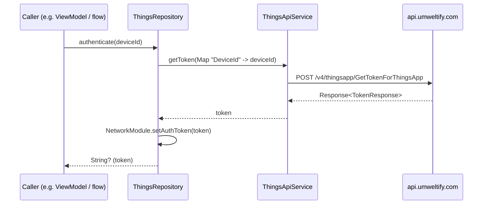

---

### 2.10 Sync device info only (Auth / Authorize)

**When:** After login or in Authorize flow to refresh device info without full init.

**Callers:** `AuthViewModel`, `AuthorizeViewModel` → `ThingsRepository.syncDeviceInfo()`.

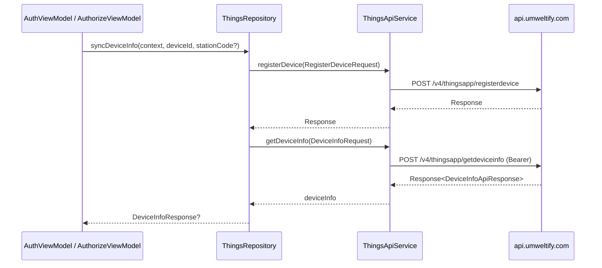

---

## 3. Summary table – which and when

| **When** | **Caller** | **API endpoint** | **Method** |
|----------|------------|------------------|------------|
| App start, no token | SplashViewModel → ThingsRepository | `/v4/thingsapp/registerdevice` | POST |
| ↑ same flow | ThingsRepository | `/v4/thingsapp/GetTokenForThingsApp` | POST |
| ↑ same flow | ThingsRepository | `/v4/thingsapp/getdeviceinfo` | POST |
| App start, has token | SplashViewModel → ThingsRepository | `/v4/thingsapp/registerdevice` | POST |
| ↑ same flow | ThingsRepository | `/v4/thingsapp/getdeviceinfo` | POST |
| Onboarding complete | OnboardingViewModel → ThingsRepository | Same as “App start, no token” (registerDevice → getToken → getDeviceInfo) | |
| Home load / refresh | HomeViewModel | `/v4/thingsapp/getdeviceinfo` | POST (direct API) |
| User submits station code | HomeViewModel / AuthorizeViewModel → ThingsRepository | `/v4/thingsapp/setstation` | POST |
| Periodic consumption upload | HomeViewModel → ThingsRepository | `/v4/androidapp/adddeviceconsumption` | POST |
| Charging started | BatteryService | `/v4/thingsapp/setstation` | POST (direct API) |
| Charging started | BatteryService | `/v4/thingsapp/setclimatestatus` | POST (direct API) |
| Update alias | ViewModel → ThingsRepository | `/v4/thingsapp/setdevicealias` | POST |
| Green login auth | AuthorizeViewModel → ThingsRepository | `/v4/thingsapp/greenloginauth` | POST |
| Re-auth (token only) | ThingsRepository.authenticate() | `/v4/thingsapp/GetTokenForThingsApp` | POST |
| Auth / Authorize sync | AuthViewModel / AuthorizeViewModel → ThingsRepository | `/v4/thingsapp/registerdevice` + `/v4/thingsapp/getdeviceinfo` | POST |

---

## 4. API base and interceptors

- **Base URL:** `https://api.umweltify.com`
- **Retrofit:** `NetworkModule.api` → `ThingsApiService`
- **OkHttp:**  
  - **Logging:** `HttpLoggingInterceptor` (BODY).  
  - **Auth:** `Interceptor` adds `Authorization: Bearer <token>` when `NetworkModule.getAuthToken()` is set (set after `getToken` or from cached token).

All endpoints above use this single client; only `GetTokenForThingsApp` and `registerdevice` are typically called without a Bearer token (token is obtained then stored and used for subsequent calls).
